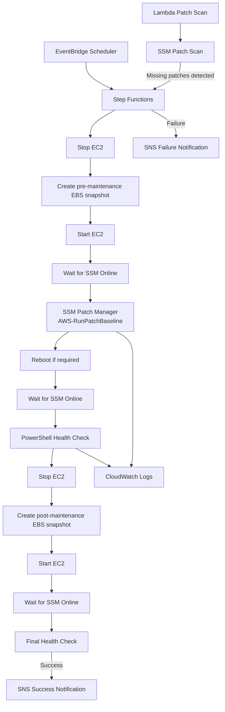

# Terraform AWS Windows Maintenance Automation

Automated Windows Server maintenance on AWS using Terraform, AWS Step Functions, Systems Manager Patch Manager, EventBridge Scheduler, CloudWatch Logs, SNS, Lambda, and GitHub Actions.

This project demonstrates an operational workflow for safely patching a private Windows EC2 instance with pre/post-maintenance snapshots, health checks, failure handling, logging, and scheduled execution.

## Architecture



## What This Project Automates

The maintenance workflow performs the following operations:

1. Starts automatically from Amazon EventBridge Scheduler.
2. Stops the Windows EC2 instance.
3. Creates pre-maintenance EBS snapshots.
4. Starts the instance again.
5. Waits until the EC2 instance and SSM Agent are available.
6. Installs approved Windows updates using `AWS-RunPatchBaseline`.
7. Reboots the instance if required.
8. Waits for Systems Manager connectivity to recover.
9. Runs a PowerShell health check.
10. Stops the instance and creates post-maintenance snapshots.
11. Starts the instance again.
12. Performs a final SSM and Windows health check.
13. Sends an SNS success or failure notification.
14. Sends SSM command output to CloudWatch Logs.

## AWS Services Used

| Service | Purpose |
|---|---|
| Terraform | Infrastructure as Code |
| Amazon EC2 | Windows Server workload |
| Amazon VPC | Private network environment |
| AWS Systems Manager | Patch installation and remote command execution |
| AWS Step Functions | Maintenance workflow orchestration |
| Amazon EventBridge Scheduler | Monthly automated execution |
| Amazon EBS | Pre/post-maintenance snapshots |
| Amazon SNS | Success and failure email notifications |
| Amazon CloudWatch Logs | Patch and health-check execution logs |
| AWS Lambda | Patch compliance scan and conditional workflow start |
| IAM | Service permissions and instance access |
| GitHub Actions | Terraform CI/CD using AWS OIDC |

## Security Design

The Windows instance is deployed into a private subnet with:

- No public IP address
- No inbound security-group rules
- No RDP or SSH access
- Administration through AWS Systems Manager
- IMDSv2 required
- Encrypted gp3 root volume
- IAM roles instead of static AWS credentials

Internet access required for Windows Update and AWS service communication is provided through a NAT Gateway.

## Step Functions Workflow

The workflow is defined in:

```text
terraform/statemachine/maintenance.asl.json
```

The state machine handles EC2 stop/start operations, EBS snapshot creation and polling, SSM availability checks, Windows patch installation, reboot recovery, PowerShell health checks, retry logic, failure handling, and SNS notifications.

### Patch Installation

Windows patches are installed using `AWS-RunPatchBaseline` with:

```text
Operation = Install
RebootOption = RebootIfNeeded
```

The workflow waits for the patch command to complete and checks the resulting command status before continuing.

## Health Checks

After patching, Systems Manager runs a PowerShell health check. The workflow checks the Windows Management Instrumentation service and retrieves recently installed hotfixes.

```powershell
$ErrorActionPreference = 'Stop'
$service = Get-Service -Name 'Winmgmt'

if ($service.Status -ne 'Running') {
    throw 'Winmgmt service is not running.'
}

Get-HotFix |
    Sort-Object InstalledOn -Descending |
    Select-Object -First 5
```

A final health check is also performed after the post-maintenance snapshot cycle.

## CloudWatch Logging

SSM command output is sent to:

```text
/aws/ssm/windows-maintenance
```

This provides logs for Windows patch execution and PowerShell health checks. The Terraform-managed log group uses a 30-day retention period.

## Notifications

Amazon SNS sends email notifications for both successful and failed maintenance runs. Failures caught by the Step Functions workflow are forwarded to SNS with the reported failure cause.

Example failure notification:

```text
Windows maintenance failed.
Cause: Post-patch Windows health check failed
```

## Scheduled Execution

Amazon EventBridge Scheduler starts the maintenance workflow automatically.

Current schedule:

```text
Monthly at 02:00 on the first day of each month
Timezone: Europe/London
```

Terraform configuration:

```hcl
schedule_expression          = "cron(0 2 1 * ? *)"
schedule_expression_timezone = "Europe/London"
```

Using the local timezone allows the schedule to follow GMT/BST changes automatically.

## Patch Scan Lambda

The project includes a Python Lambda function that performs a patch compliance scan using Systems Manager.

The Lambda:

1. Executes `AWS-RunPatchBaseline` with `Operation=Scan`.
2. Waits for the scan to complete.
3. Retrieves the instance patch state.
4. Checks `MissingCount`.
5. Starts the Step Functions maintenance workflow when approved patches are missing.

This separates patch-compliance detection from the maintenance workflow itself.

## CI/CD

Terraform deployment is automated with GitHub Actions and AWS OIDC authentication, avoiding long-lived AWS access keys.

For pull requests affecting `terraform/**`, the workflow runs:

```text
terraform fmt -check
terraform init
terraform validate
terraform plan
```

A push to `main` additionally runs:

```text
terraform apply -auto-approve
```

A separate `workflow_dispatch` workflow is provided for manual `terraform destroy`.

## Repository Structure

```text
.
├── .github/
│   └── workflows/
│       ├── main.yml
│       └── destroy.yml
│
└── terraform/
    ├── cloudwatch.tf
    ├── ec2.tf
    ├── eventbridge.tf
    ├── iam.tf
    ├── iam_step_functions.tf
    ├── lambda.tf
    ├── main.tf
    ├── output.tf
    ├── sns.tf
    ├── step_functions.tf
    ├── variables.tf
    ├── vpc.tf
    ├── lambda/
    │   └── patch_scan.py
    └── statemachine/
        └── maintenance.asl.json
```

## Deployment

### Prerequisites

- AWS account
- Terraform
- Existing S3 backend bucket
- GitHub repository
- GitHub Actions OIDC IAM role
- Email address for SNS notifications

### Configure Variables

Create a local `terraform/terraform.tfvars` file. It should not be committed to the repository.

```hcl
notification_email = "your-email@example.com"
```

### Deploy Locally

```bash
cd terraform
terraform init
terraform fmt
terraform validate
terraform plan
terraform apply
```

After deployment, confirm the SNS email subscription.

## Validation

The project was tested using both happy-path and failure-path scenarios.

### Happy Path

The following end-to-end path was validated:

```text
EventBridge Scheduler
        ↓
Step Functions
        ↓
EBS snapshots
        ↓
Windows patch installation
        ↓
SSM recovery
        ↓
Windows health checks
        ↓
CloudWatch Logs
        ↓
SNS success notification
```

### Failure Path

Negative testing was performed by deliberately changing the PowerShell health check to query a non-existent Windows service:

```powershell
Get-Service -Name 'DefinitelyDoesNotExist'
```

This produced a failed SSM command and confirmed that the health-check failure was detected, the Step Functions failure path executed, the failure cause was propagated, and the SNS failure notification was sent successfully.

The normal `Winmgmt` health check was restored after testing.

## Key Design Decisions

### No inbound administrative access

The Windows server has no inbound rules and is managed through Systems Manager rather than exposing RDP.

### Pre- and post-maintenance snapshots

Snapshots provide restore points around the maintenance operation and reduce recovery risk.

### State-aware orchestration

The workflow checks EC2, snapshot, patch, and SSM states before moving to the next stage instead of assuming operations have completed.

### Separate notification and troubleshooting paths

SNS provides operator notification, while CloudWatch Logs stores execution details for troubleshooting.

### Failure-path testing

The project validates not only the successful maintenance flow but also deliberately induced failures.

## Future Improvements

- Automated EBS snapshot retention and cleanup
- CloudWatch alarms for repeated workflow failures
- Multi-instance maintenance support
- Maintenance windows and approval controls
- Tighter IAM resource scoping
- Structured patch-compliance reporting
- Deployment rollback logic
- VPC endpoints to reduce NAT dependency where appropriate

## Purpose

This project was created as a hands-on infrastructure automation exercise focused on AWS operations, Windows Server maintenance, Terraform, Step Functions, Systems Manager, scheduled automation, observability, operational failure handling, and CI/CD.
